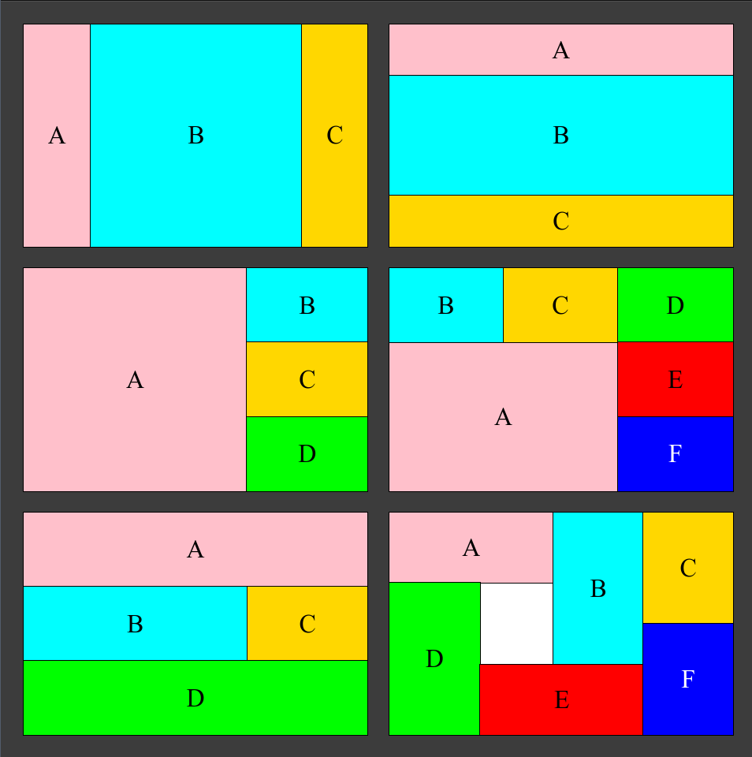

# Frontend Layout Exercise

## Goal:
### Complete the following in 15 minutes or less:

- create a new project in a dedicated directory
- initialize a git repository for the new project
- create a README.md file
- create a responsive webpage that looks like this:

### Notes:
- all of the layouts are the same size
- each of the sections always has the same color. A is always pink, etc.
- you can choose your own colors for the sections and backgrounds
- the layout should be responsive. Choose your units accordingly.
- there are many ways to do this. the proposed solution is not the only one.

[Solution](doc/solution.md)