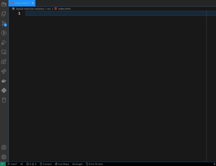
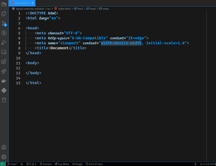
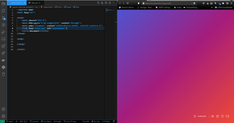

# Frontend Layout Exercise Solution

## Explanation:

Since the primary goal of this exercise is to produce the layouts quickly and
efficiently, we "pre-create" the pieces in advance so that all that needs to be
done is to compose them later.

Each layout is made up of between 3 and 6 "boxes". These are block elements with
unique colors placed in a row, column, or grid.

Normally, we think of a grid as having at least 2 rows and 2 columns, but to make
things easier here, I consider everything as a grid layout.

Each layout will be its own grid, defined by composing "boxes".

The body itself is a grid of the layouts, so it needs to be styled as well.

It's a good practice to save incremental changes as separate commits, that's 
how we'll do it here, too.

Note that we assume here that we just need to get this done. Refactoring the
project structure (like moving things into folders) is left for another time.

How you like to use git is up to you. In this solution, I will use the cli.

It is important to note that in the interests of saving time, the markdown will
be as simple as possible, so that it is easy to create. I will be using
emmet to save a lot of time and keystrokes as well.

## Solution

### Scaffold the Project
1. create the project directory: `mkdir -p project && cd project`

2. initialize a new git repo: `git init .`

3. create a README.md for your project: `echo "Layout Exercise" > README.md`

4. create the html file: `touch index.html`

5. create the css file: `touch site.css`

6. open the html file in vscode: `code index.html`

7. using emmet, create the initial html:

   

8. link the stylesheet:

   

9. create the reset style and make sure that everything works using live server:

    

10. commit: 
```
   git add -A
   git commit -m 'initial commit'
```